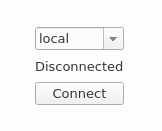
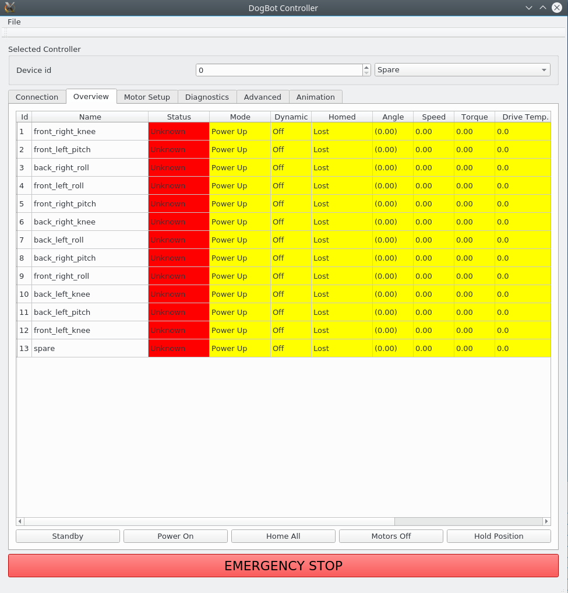
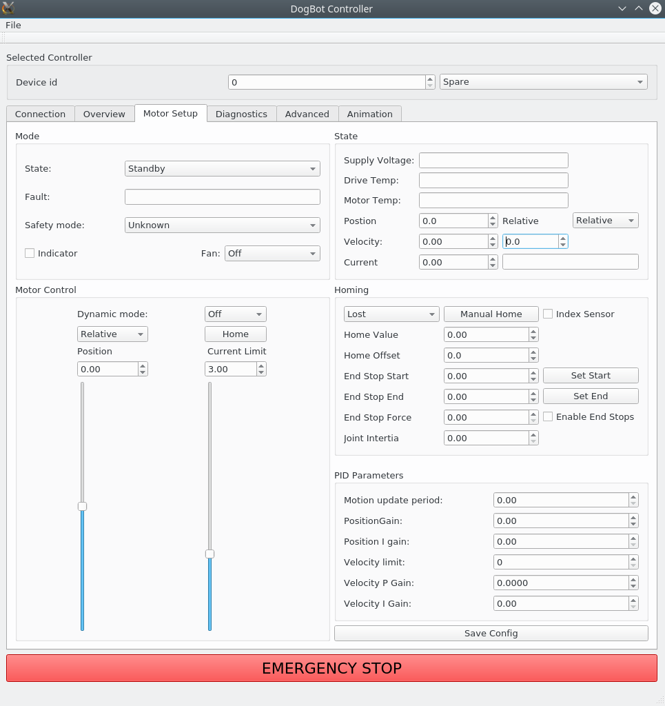
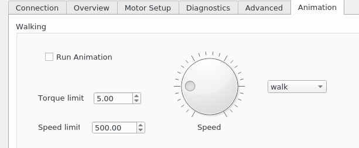

# Dogbot (repo BMC2-Firmware)

[DogBot] is a quadruped robot developed by [React AI] as a platform for researching robotics, AI and more.

This repository contains firmware and a UI for interacting with the [DogBot] robotic hardware platform developed by [React AI], as well as CAD designs, along with software for higher-level systems for control and operation of the DogBot robot via [ROS].

Note: areas of this code are still work-in-progress.

# Installation

## Pre-requisites

This code has been tested for installation and operation on Ubuntu Linux 16.04.  Requires the packages: `libspdlog-dev libjsoncpp-dev libeigen3-dev libzmq3-dev libusb-1.0.0-dev mesa-common-dev build-essential libgl1-mesa-dev`

[Qt] is required to build and run the UI, it was built and tested with Qt versions 5.9.2 and 5.11 64-bit.

[ROS] must be installed if ROS interaction is required; the code has been tested against the Kinetic release.  The repository contains a [catkin](http://wiki.ros.org/catkin) workspace under [ROS](./ROS), which should be built with `catkin build`

For ROS operation you may need to install the packages `ros-kinetic-rosparam-shortcuts ros-kinetic-ros-control ros-kinetic-ros-controllers ros-kinetic-pluginlib` 

The [DataRecorder](./Utilities/DataRecorder) utility requires [PostgreSQL] 9.5 or higher, and is intended to be viewed using [Grafana]

## Setup steps: Scripted

There is an installation script at [setup.sh](./Scripts/setup.sh) to run various setup steps. The first argument is the dog's name.  If the second argument is passed as 1, the build scripts are also called, which should complete all required tasks, e.g. `setup.sh tango 1`

The individual scripts may also be called:
* [setup.sh](./Scripts/setup.sh) - sets permissions, links config file; optionally calls the build scripts
* [buildall.sh](./Scripts/buildall.sh) - wraps the build steps for the C++ projects (API and data recorder)
* [rosbuild.sh](./Scripts/rosbuild.sh) - wraps catkin build for ROS components

## Setup steps: Manual

These steps are an alternative to the scripted install.

First, to use a USB connection you need access to the appropriate device:

```bat
sudo cp ./API/src/reactai.rules /etc/udev/rules.d/
sudo udevadm control --reload-rules && udevadm trigger
```

The configuration file for your specific Dogbot has to be accessible to the UI, which is done via a symlink.  To use the configuration for Tango, for example:

```bat
mkdir -p ~/.config/dogbot
ln -s ~/src/RR/DogBot/Config/tango.json ~/.config/dogbot/robot.json
```
Then the code under [API](./API) and [DataRecorder](./Utilities/DataRecorder) should be built with `cmake', 'make` and `make install`, for the API for example:

```bat
cd ./API
mkdir -p build
cd build
cmake ../src/
make
sudo make install
```

# Operation

Please refer to the product user-guide for warnings and safety considerations.

## Switch On

Use a benchtop power supply of between 14V and 30V

* Check cables are red-red throughout; check for loose wires, obstructions
* Connect power supply
* Connect the gray data cable from the DogBot to the intermediate controller
* connect the controller via a USB cable to your PC
* Switch on power supply (switch on the back should be in the down position)

## Connecting to the Controllers

The UI can make a direct USB connection, or connect to a local instance of 'dogBotServer'.  The latter is recommended, as it allows for multiple local clients, e.g. multiple UIs, or UI plus a ROS client.

run the local server:
```bat
cd API/build/
./dogBotServer
```
When you build and run the client in Qt, it will open to a connection screen:

* open Qt Creator
* open and run GUI/DogBotUI.pro
* pick 'local' as the connection type
* click 'Connect'



On the Overview tab you should then see a summary row for each detected motor.  The name of each motor (e.g. back left knee) will be picked up from the configuration file.

## Homing the Motors

To operate the motors via ROS, they must be homed, i.e. made aware of their absolute position.   This requires them to move past their end-stops, which are detected magnetically.

The 'Homed' column on the UI overview tab will probably say 'Lost' in their pre-homed start-up state.



Homing the motors, method 1:
* set all motors to Standby with the 'Standby' button on the bottom left
* press the Power On button
* ensure all the limbs have room to move
* Press the Home All button

You may need to press Home All again if all 12 motors do not home the first time.

Method 2, if a particular motor has a problem:
* note the ID for the required joint on the Overview tab
* move to the Motor Setup tab, pictured below, and select the motor by its ID
* Press the Home button under Motor Control

This screen can be used to reset a motor, for example if it has entered an emergency stop state.

Method 2a, manual homing:
* Set the Dynamic Mode to Relative
* set the current limit to around 2.5A
* carefully move the motor by using the Position slider, backwards and forwards until it reaches its end-stop points.  The Homing status should change to Homed.

If the motor oscillates there may be insufficient current for the control loop to complete, increase the current limit in this situation.



The motor may now be controlled via ROS if you wish.

## Sample Operation

There are two scripted gaits for demonstration, a walk and a trot.  These can be run from the UI as shown below, or using the script at `./API/build/dogBotWalk` (use `--gait trot` to trot).



# ROS Control

**Note:** complete the UI setup steps before starting the ROS components.  The hardware interface node in ROS will send conflicting signals if it is operational while the UI tries to alter the motor positions.

To get started with ROS control, build and source the code then run `dogbot_hardware.launch`

```bat
cd Software/ROS
catkin build
source devel/setup.bash
roslaunch dogbot_control dogbot_hardware.launch
```

This launches a hardware interface node of type dogbot_control/dogbot_hw_main, which uses the [ros_control](http://wiki.ros.org/controller_manager) package to spawn and interact with ROS controllers.  This provides a framework for different controller types, as well as standardising interactions with Gazebo and RViz.

If you are controlling other equipment you may require a different launch file, such as testrig_hardware.launch

## Further ROS Control

The motors can now be controlled by interacting directly with ROS topics or via ROS nodes. Further details are in the ROS directory [readme file](./ROS)

# Useful Tools
* stlink programming: https://github.com/texane/stlink
* Bootloader:         https://www.feaser.com/openblt

# Contributing

If you wish to contribute please fork the project on GitHub. More details to follow

# License

Details to follow

[DogBot]: https://www.reactai.com/dog-bot/
[React AI]: https://www.reactai.com
[ROS]: http://www.ros.org
[Qt]: https://www.qt.io
[PostgreSQL]: https://www.postgresql.org/
[Grafana]: https://grafana.com/